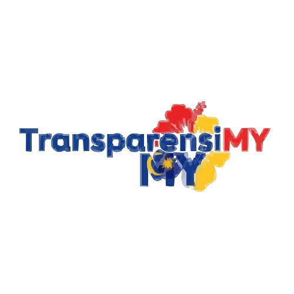

# TransparensiMY: Government Spending Transparency Dashboard



**TransparensiMY** is a proof-of-concept dashboard designed to enhance transparency in government spending. It provides a user-friendly interface for citizens and officials to track, analyze, and manage public projects and budgets, with all transactions securely recorded on a blockchain for immutability and trust.

## ✨ Features

-   **📊 Interactive Dashboard:** Get a high-level overview of key metrics, including total spending, budget allocation, and project statuses.
-   **📂 Project Tracking:** View a detailed list of all government projects, with filtering and search capabilities.
-   **🏢 Department Overview:** Analyze spending and budget utilization across different government ministries.
-   **📈 Advanced Analytics:** Dive deep into spending trends, project distribution, and department efficiency with interactive charts and graphs.
-   **⚙️ Admin Panel:** A secure area for administrators to add new transactions, manage users, and configure blockchain settings.
-   **🗣️ Citizen Feedback:** A built-in modal for citizens to provide ratings and comments on specific projects.
-   **🌐 Multi-language Support:** Switch between English and Malay for better accessibility.
-   **🎨 Modern UI:** Built with the Malaysian Government Design System (`govtechmy/myds`) for a consistent and accessible user experience.

## 🚀 Tech Stack

-   **Frontend:** [React](https://reactjs.org/), [TypeScript](https://www.typescriptlang.org/), [Vite](https://vitejs.dev/)
-   **Styling:** [Tailwind CSS](https://tailwindcss.com/), [@govtechmy/myds](https://myds.gov.tech/)
-   **Charts:** [Recharts](https://recharts.org/)
-   **Icons:** [Lucide React](https://lucide.dev/) & [@govtechmy/myds-react/icon](https://myds.gov.tech/)

##  Roadmap: SUI ZKlogin Integration

A key feature planned for the future is the integration of **SUI ZKlogin** to enhance the security and user experience of the platform, particularly for the citizen feedback and administrative functionalities.

### What is SUI ZKlogin?

**zkLogin (Zero-Knowledge Login)** is a service developed by Mysten Labs that allows users to sign transactions on the Sui blockchain using their existing Web2 credentials from providers like Google, Twitch, Facebook, and more. It leverages zero-knowledge proofs to translate a user's OAuth credentials into a secure, on-chain signature without exposing any private information or requiring the user to manage a traditional crypto wallet.

### Why SUI ZKlogin for TransparensiMY?

1.  **Seamless User Experience:** Citizens can provide authenticated feedback by logging in with their familiar Google or other social accounts, removing the friction of creating and managing new wallet credentials. This will significantly increase user adoption.
2.  **Enhanced Security for Admins:** Administrators can manage the platform using their trusted Web2 accounts, eliminating the risks associated with storing and handling private keys.
3.  **Increased Trust and Verifiability:** By having citizens and admins sign transactions (like submitting feedback or adding new projects) via zkLogin, we can create a fully on-chain, verifiable, and tamper-proof audit trail without compromising user privacy.

## ⚙️ Getting Started

Follow these instructions to get a copy of the project up and running on your local machine for development and testing purposes.

### Prerequisites

-   [Node.js](https://nodejs.org/) (v18 or later)
-   [npm](https://www.npmjs.com/)

### Installation

1.  Clone the repository:
    ```bash
    git clone https://github.com/your-username/transparencymy.git
    ```
2.  Navigate to the project directory:
    ```bash
    cd transparencymy
    ```
3.  Install the dependencies:
    ```bash
    npm install
    ```

### Running the Application

To start the development server, run the following command:

```bash
npm run dev
```

The application will be available at `http://localhost:5173`.

## 🤝 Contributing

Contributions are welcome! Please feel free to submit a pull request or open an issue to discuss your ideas.

1.  Fork the Project
2.  Create your Feature Branch (`git checkout -b feature/AmazingFeature`)
3.  Commit your Changes (`git commit -m 'Add some AmazingFeature'`)
4.  Push to the Branch (`git push origin feature/AmazingFeature`)
5.  Open a Pull Request

## 📄 License

This project is licensed under the MIT License - see the `LICENSE` file for details.